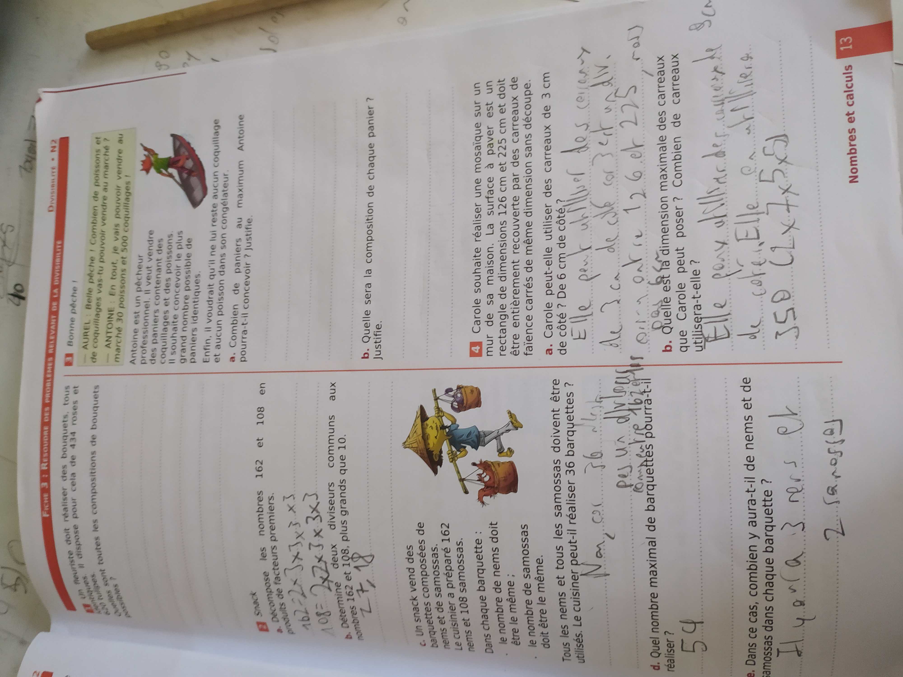
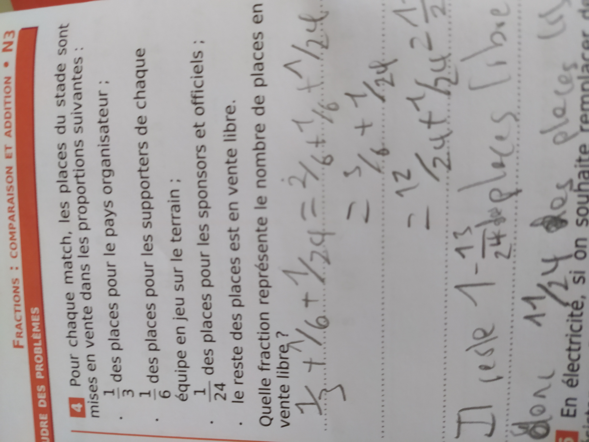
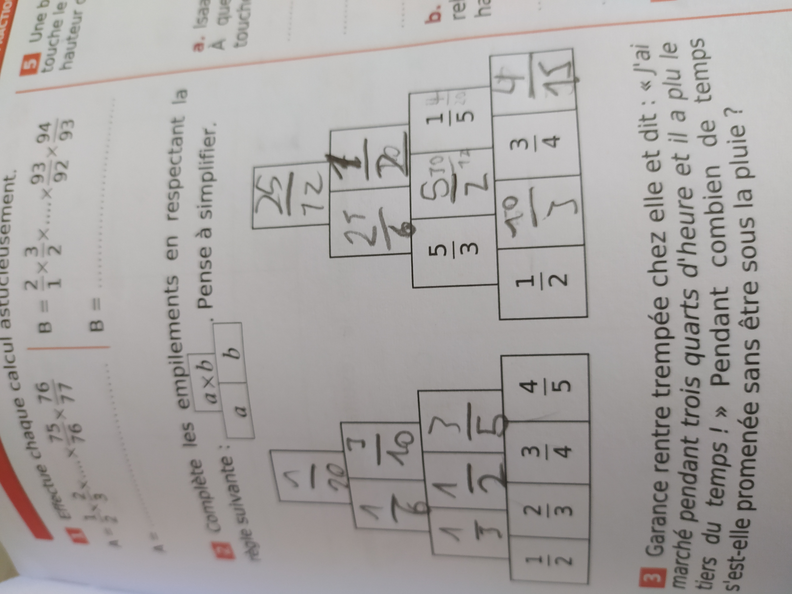
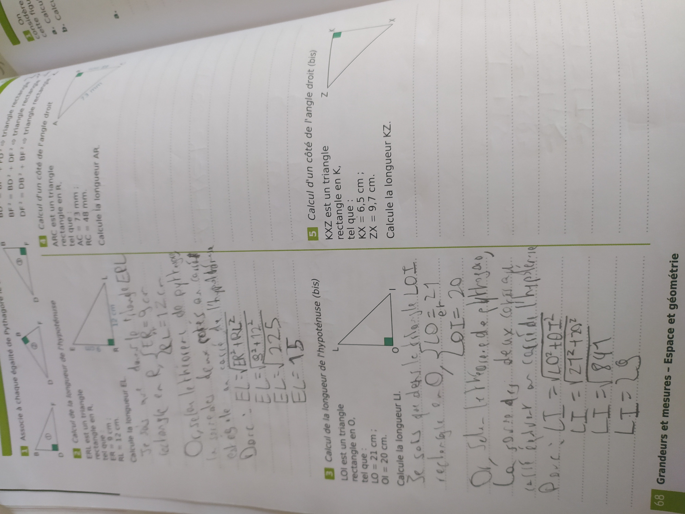
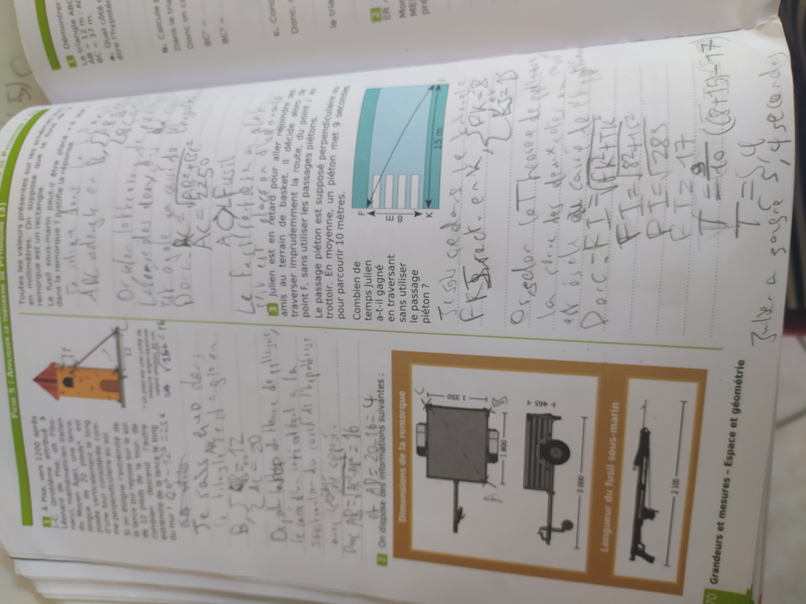

# Les maths a la maison, semaine G+1
## Theme 1
### Ex. 56 p.64
Virginie peut remplir 6 verres, car (2/3)/(1/9)=6
### Ex. 77 p. 66
#### 1.
##### a.
Victor a une pointure francaise de 39
##### b.
Victor a une pointure americaine de 6
#### 2.
Victor a une pointure anglaise adulte de `4.527559055118111
...`
```js
/**
 * Ceci est du code transformé en pseudocode
 * afin de le rendre lisible aux personnes
 * ne comprenant pas le language que j'utilise.
 * 
 * Ne pas essayer de l'executer avec quelconque
 * interpréteur.
**/
let taille=25
let tailleEnMm=250
let mmEnPouces=x/25.4
let adulte;
let etapeUne=mmEnPouces(tailleEnMm)-4
let etapeDeux=etapeUne/(1/3)
si(etapeDeux>13){
	adulte=vrai,
	etapeTrois=etapeDeux-13
}sinon{
	adulte=faux,
	etapeTrois=etapeDeux
}
sortirConsole(etapeTrois)
```
## Theme 2
### Ex. 16 p.246
NP=(6²+8²)^0.5
NP=10
NP mesure 10dm
### Ex. 46 p.250
BC=(2.5²+7²)^0.5
BC=7.433034373659253...
BI=2.5+7.433034373659253...
BI=9.933034373659253...
L'arbre mesurait 9.933034373659253...m de haut avant sa destruction naturelle imprévue. R.I.P. arbre.
## TD





