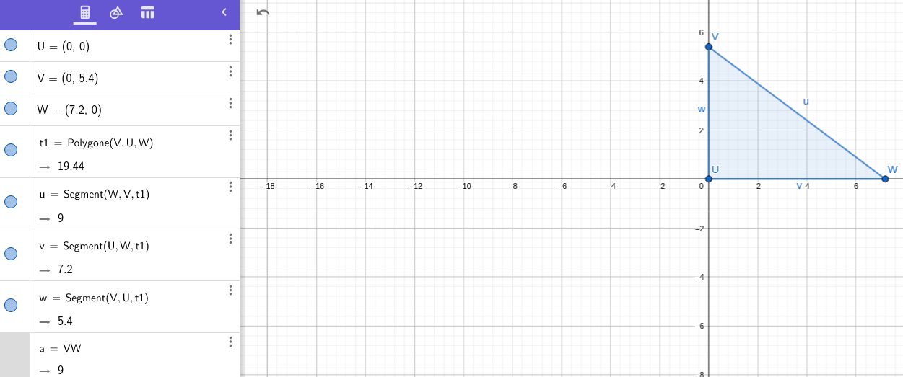

# Theoreme de pythagore

## Manuel

### P. 247 

32)a)Vrai

   b)Vrai
   
   c)Vrai
   
   d)Faux
   
   e)Vrai
   
33)Oui, car 29+55=84cm

34)Je sais que dans le triangle AMP rectangle en M, {AM=10.5 et PM=14}.

Or, selon le theoreme de pythagore, la somme des deux cotés au carré est égale au carré de l'hypothénuse.

```markdown
Donc AP=√(AM²+AM²)
     AP=√(10.5²+14²)
     AP=√(110.25+196)
     AP=17.5m
``` 
Ousmane a donc raison

35)

## TD

### P. 71

1)a)CB, car il est plus grand que CA et AB séparéments, mais il est plus petit que la somme de CA et AB

  b)Dans le triangle ABC, le plus long coté est BC
    donc on calcule séparément: 
    
    BC²=17²
    
    BC²=1369
    
    AB²+AC²=35²+12²
    
    AB²+AC²=1225+144
    
    AB²+AC²=BC²
  c)Donc, d'apres la réciproque du theoreme de pythagore, le triangle ABC est rectangle.
  
2)
  a)MER est rectangle en E car l'hypohénuse est MR car il est plus grand que ME et ER séparéments, mais il est plus petit que la somme de ME et ER
  b)Je sais que dans le triangle MER rectangle en E, {ME=2.21 et RE=0.6}.
Or, selon le theoreme de pythagore, la somme des deux cotés au carré est égale au carré de l'hypothénuse.
```markdown
Donc MR=√(ME²+ME²)
     MR=√(2.21²+0.6²)
     MR=√(4.8841+0.36)
     MR=2.29m
```
MR étant égal à 2.29m, MER est rectangle

### P. 71

3) Je sais que dans le triangle ABC rectangle en B, {AB=40 et CB=42}.
Or, selon le theoreme de pythagore, la somme des deux cotés au carré est égale au carré de l'hypothénuse.
```markdown
Donc AC=√(AB²+AB²)
     AC=√(40²+42²)
     AC=√(1600+1764)
     AC=58cm
``` 
AC étant égal a 58cm, ABC est rectangle et son étagere, horizontale.

# Calcul littéral

## TD

### P. 44

1)A)2\*x-7

  B)4\*x\*(2.5-x)
  
  C)x\*x-6\*x+2
  
  D)(5\*x-4)\*(3+x)
  
2)E)3\*4+5=17

  F)4\*(6-2\*4)=-8
  
  G)5\*(3-4)=-5
  
  H)-2\*(5\*4-30)
  
3)J)0

  K)-7
  
  L)12
 
  M)13
  
## Manuel

15)

a)3x

b)8y

c)10z

d)0

e)b

f)4c²

g)18xy

h)3u+11v

16)

a)12x

b)8y

c)n+5n²

d)z²

e)

f)

